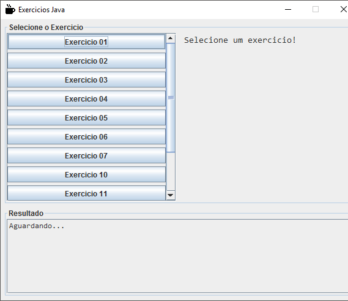
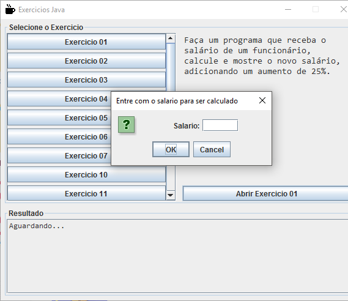

# java_windowbuilder

# java_windowbuilder
##### Projeto: java_windowbuilder
###### Criado por: Denilson Araujo (conta dev)

  

 
#

#
### SOBRE
###### Programa em Java utilizando windowbuilder para treinar/passar tempo, onde se encontra alguns cálculos simples.

### ALGUNS LINKS:
- ###### [Visite o site do LCP](https://lcp.eteccruzeiro.dev.br/)
- ###### [Acesse o Repositorio do site](https://github.com/denilsonfa/LCPListadeComprasPersonalizadasSite)
- ###### [Documentação do TCC](https://lcp.eteccruzeiro.dev.br/doc.html)
- ###### [Termos de Uso da aplicação](https://lcp.eteccruzeiro.dev.br/termos.html)
- ###### [Aplicação no Google Play](https://play.google.com/store/apps/details?id=br.com.dla.lcp)
